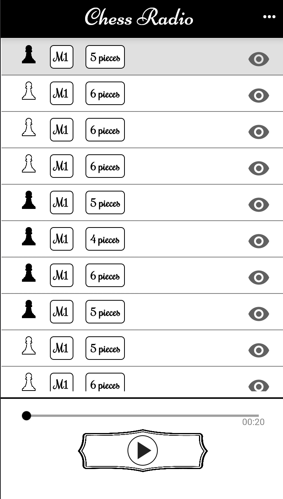

# Chess Radio

Chess Radio is an open-source platform to practice chess visualization (a.k.a. Blindfold chess). This forces players to maintain a mental model of the positions of the pieces.

The app is devloped with Flutter and is available for Android, iOS, and web.

Chess Radio is FREE and will always be FREE.

  

